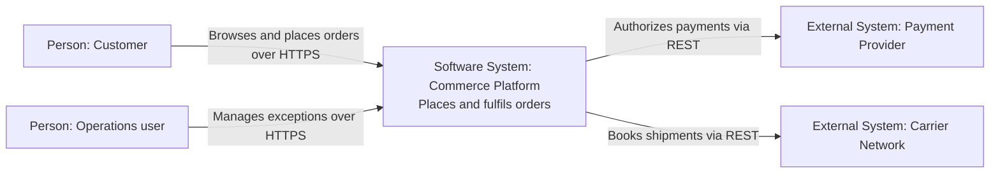
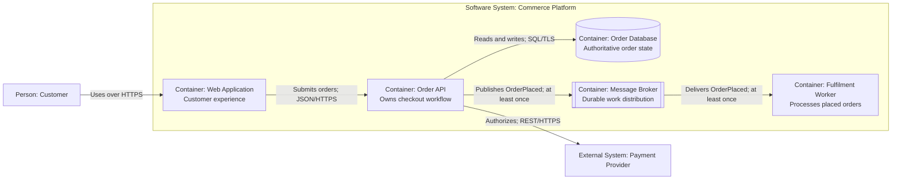
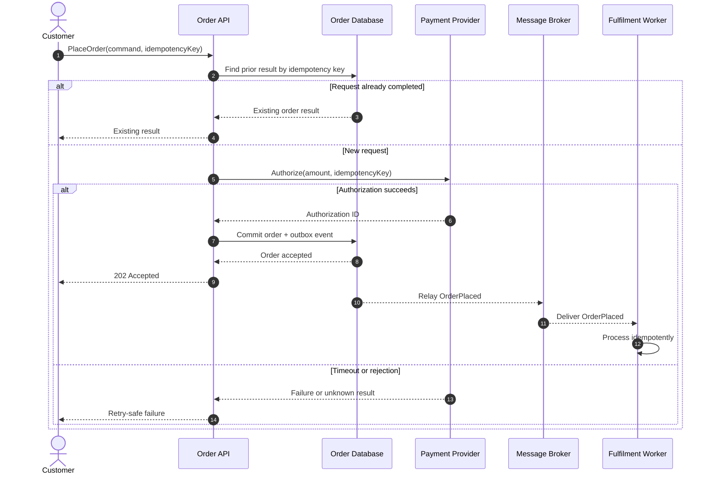
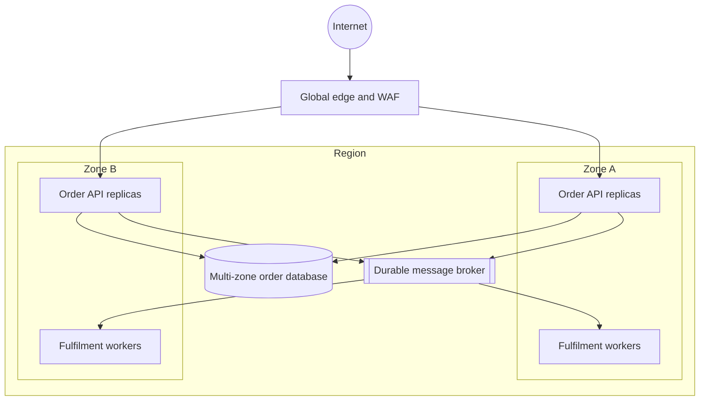

# Diagram Patterns

Use this when: producing Mermaid or D2 technical architecture views after the audience and question have been selected.

Use [visual-communication.md](visual-communication.md) for Level 0 maps, view selection, accessibility, SVG delivery, infographics, and upgrade overlays. This file owns technical C4, sequence, deployment, and diagrams-as-code source patterns.

## Contents

- [C4 context with Mermaid](#c4-context-with-mermaid)
- [C4 container with Mermaid](#c4-container-with-mermaid)
- [Container view with D2](#container-view-with-d2)
- [Critical workflow with Mermaid](#critical-workflow-with-mermaid)
- [Deployment view with Mermaid](#deployment-view-with-mermaid)
- [Diagram checks](#diagram-checks)

## C4 context with Mermaid

Show people, the system of interest as one box, and external software systems. Do not expose internal services here.



## C4 container with Mermaid

Show independently runnable applications and data stores within the system boundary. Name technology only when chosen and relevant.



## Container view with D2

Use D2 when compact grouping and portable source files are preferable.

```d2
direction: right

customer: Customer { shape: person }
payments: Payment Provider { shape: rectangle }

platform: Commerce Platform {
  web: Web Application
  api: Order API
  worker: Fulfilment Worker
  orders: Order Database { shape: cylinder }
  broker: Message Broker { shape: queue }

  web -> api: Submit order / JSON HTTPS
  api -> orders: Read and write / SQL TLS
  api -> broker: OrderPlaced / at-least-once
  broker -> worker: OrderPlaced / at-least-once
}

customer -> platform.web: Uses / HTTPS
platform.api -> payments: Authorize / REST HTTPS
```

## Critical workflow with Mermaid

Show the primary path plus timeout, duplicate, or asynchronous failure behavior. Match the guarantees described in prose.



## Deployment view with Mermaid

Use a separate view for infrastructure and failure domains. Do not call cloud resources C4 components.



## Diagram checks

- State the diagram type, scope, audience, and question.
- Apply the accessibility, rendering, inspection, and delivery contract in [visual communication](visual-communication.md#deliver-and-validate-visuals).
- Use one meaning for each shape and line style and explain non-obvious semantics.
- Label relationships with action and protocol, event, or delivery guarantee.
- Draw separate relationships when direction or semantics differ.
- Keep logical views vendor-neutral; put infrastructure products in deployment views.
- Put failure behavior in sequence or state views rather than structural views.
- Store editable source near architecture documentation or ADRs; render in CI when the repository supports it.
