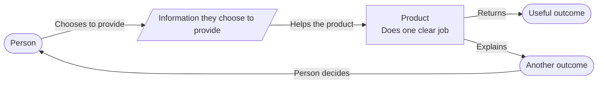
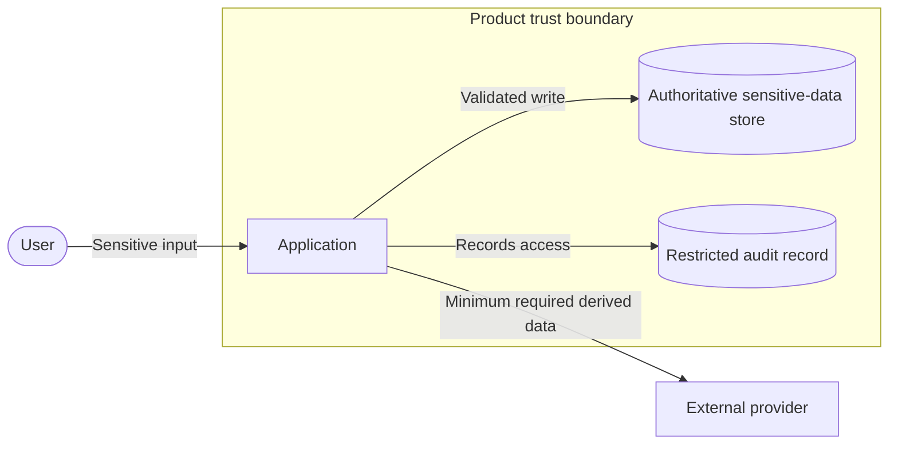
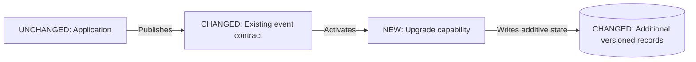

# Visual Communication

Use this when: explaining architecture visually, serving mixed or nontechnical audiences, selecting a view type, rendering or exporting SVG, or showing how an upgrade changes a baseline.

## Contents

- [Use two visual lanes](#use-two-visual-lanes)
- [Select the view by question](#select-the-view-by-question)
- [Create a Level 0 product map](#create-a-level-0-product-map)
- [Show small upgrades](#show-small-upgrades)
- [Choose Mermaid or an infographic](#choose-mermaid-or-an-infographic)
- [Deliver and validate visuals](#deliver-and-validate-visuals)
- [Templates](#templates)

## Use two visual lanes

Keep explanatory and canonical views distinct:

1. **Explanatory lane:** use a Level 0 product map or infographic for fast thinking, novice explanation, product discussion, or executive communication.
2. **Technical lane:** use C4, sequence, state, data-flow, deployment, and decision views for engineering precision.

A Level 0 map is not C4 Level 1 and does not replace a technical view when engineers need structural guarantees. When labels differ between lanes, provide a compact alias list such as `Keeps your records safe → Encrypted object storage`.

## Select the view by question

| Question | Preferred view |
|---|---|
| What does this product do for people? | Level 0 product map or infographic |
| Who interacts with the system? | C4 context |
| What applications and stores run and own data? | C4 container |
| How is one container structured? | C4 component |
| What happens in order, including failure? | Sequence |
| What lifecycle can an entity enter? | State |
| Where can sensitive data travel or cross trust? | Data-flow and trust-boundary |
| Where does software run and fail? | Deployment |
| Which option best fits the drivers? | Decision matrix or trade-off map |
| What changes in this upgrade? | Delta/evolution overlay |
| How is delivery phased? | Roadmap or migration view |

Add a view only when its question matters. Prefer several small, single-purpose views to one crowded picture.

## Create a Level 0 product map

Show roughly five to nine recognizable concepts:

- People or groups
- Inputs they knowingly provide
- One clear product responsibility
- Outcomes they receive
- Important external parties when they affect trust or expectations

Use plain nouns and verb-led relationships. Replace infrastructure and protocol language with user-observable behavior. State the audience, question, and deliberately hidden complexity beside the visual.

Keep conceptual types honest. Distinguish people, inputs, the product, external parties, and outcomes through labels and shapes; do not rely on color. Make wake-up signals, notifications, storage, and actual content delivery visually distinct.

## Show small upgrades

Reuse the baseline layout and show only affected actors, capabilities, stores, and flows. Mark each affected element textually as `NEW`, `CHANGED`, or `UNCHANGED`.

- Use a delta overlay for structural or ownership changes.
- Add a state diagram when an entity gains lifecycle states.
- Add a focused sequence when ordering, failure, or asynchronous behavior changes.
- Keep the unchanged architecture as a short reference rather than redrawing it.

An upgrade visual is complete when a reader can identify what changes, what remains stable, which contract absorbs the change, and how rollout or rollback works.

## Choose Mermaid or an infographic

Use Mermaid or D2 as the canonical semantic source when labeled nodes and relationships explain the architecture. Use a custom SVG infographic when the audience needs presentation-quality hierarchy, metaphor, branded storytelling, or spatial explanation that automatic layout cannot express clearly.

Create the infographic from the validated semantic skeleton. Keep its labels traceable to the canonical model, preserve a textual equivalent, and treat the infographic as explanatory rather than authoritative.

## Deliver and validate visuals

When the user requests visual artifacts, deliver:

1. Editable source such as `.mmd` or `.d2`
2. Rendered SVG when requested or when a supported renderer is available
3. A concise textual equivalent or interpretation
4. A title and description; use Mermaid `accTitle` and `accDescr`
5. A legend when shape, line, or marker meanings are not self-evident

Use [../scripts/render_diagram.py](../scripts/render_diagram.py) for supported Mermaid or D2 source. If the renderer is unavailable, preserve the source, report the missing renderer precisely, and avoid claiming the visual was inspected.

Inspect the rendered result at normal and narrow widths. Verify:

- Logical left-to-right or top-to-bottom reading order
- No clipped nodes, crossed labels, overlapping text, or ambiguous arrow direction
- Readable text, contrast, and spacing
- Responsive SVG `viewBox` and selectable text where practical
- Meaning conveyed with labels plus shape, stroke, or symbols rather than color alone
- Title, description, legend when needed, and adjacent textual equivalent
- Stable terminology across explanatory and technical views

## Templates

### Accessible Level 0 map

### Sensitive data-flow and trust boundary

### State lifecycle

```mermaid
stateDiagram-v2
    accTitle: Candidate lifecycle
    accDescr: A detected candidate waits for review, then becomes confirmed or rejected; confirmed items can later be superseded.

    [*] --> Detected
    Detected --> PendingReview
    PendingReview --> Confirmed: user confirms
    PendingReview --> Rejected: user rejects
    Confirmed --> Superseded: later confirmed change
    Rejected --> [*]
    Superseded --> [*]
```

### Upgrade delta overlay

### Decision comparison

| Option | Driver fit | Operational cost | Reversibility | Evidence gap | Decision |
|---|---|---|---|---|---|
| Current/simple option | | | | | |
| Alternative A | | | | | |
| Alternative B | | | | | |

### Roadmap

| Phase | User-visible outcome | Architecture delta | Validation | Rollback | Exit criterion |
|---|---|---|---|---|---|
