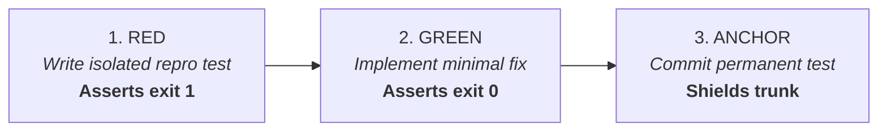

# The Regression Shield: Reproduction-First TDD

When a bug or regression occurs in production, writing a fix before writing a reproduction test invites silent regressions. The Regression Shield enforces a strict, verifiable 3-step loop.

---

## 1. The 3-Step Protocol



### Step 1: Write the Failing Reproduction Test (RED)
- Write an isolated test that recreates the defect using minimal reproduction inputs.
- Run the test against current trunk/baseline:
  ```bash
  go test -run TestRegression_TokenRefreshRace ./...
  # MUST FAIL (exit 1 or assertion failure)
  ```
- **Invariant**: If the reproduction test passes on broken code, the test is invalid. Rewrite it until it cleanly reproduces the failure.

### Step 2: Implement the Minimal Fix (GREEN)
- Modify the application source code with the minimal required change to resolve the defect.
- Run the test suite:
  ```bash
  go test -run TestRegression_TokenRefreshRace ./...
  # MUST PASS (exit 0)
  ```

### Step 3: Anchor Permanently in the Test Suite (ANCHOR)
- Commit the test into the permanent test suite. It will execute on every future PR to prevent the bug from ever recurring.

---

## 2. Naming Conventions

Test names must clearly identify that the test is a regression shield rather than a general feature test:

### Standard Standalone Repositories (Default)
Use `TestRegression_<slug>`:
```go
// Go
func TestRegression_TokenRefreshRace(t *testing.T) { ... }
```
```typescript
// TypeScript
describe('Regression: Token Refresh Race', () => { ... });
```
```python
# Python
def test_regression_token_refresh_race(): ...
```

### Spectacular Repositories (When Mission Ref Exists)
When working within a Spectacular workspace on a bound Mission (`M<N>`), tie the test directly to the Mission ref:
```go
func TestM14_TokenRefreshRace(t *testing.T) { ... }
```

---

## 3. Strict Boundary: No Governance Duplication

- **Spectacular / Issue Tracker Owns**:
  - The business justification, customer report, stack trace, and triage decision.
  - The frozen Mission claim (`claim: concurrent-refresh-safe`).
- **The Regression Test Owns**:
  - The executable proof only.
  - No bloated comments duplicating the bug ticket; the test name cites the ref (`TestM14_TokenRefreshRace` or `TestRegression_TokenRefreshRace`).
